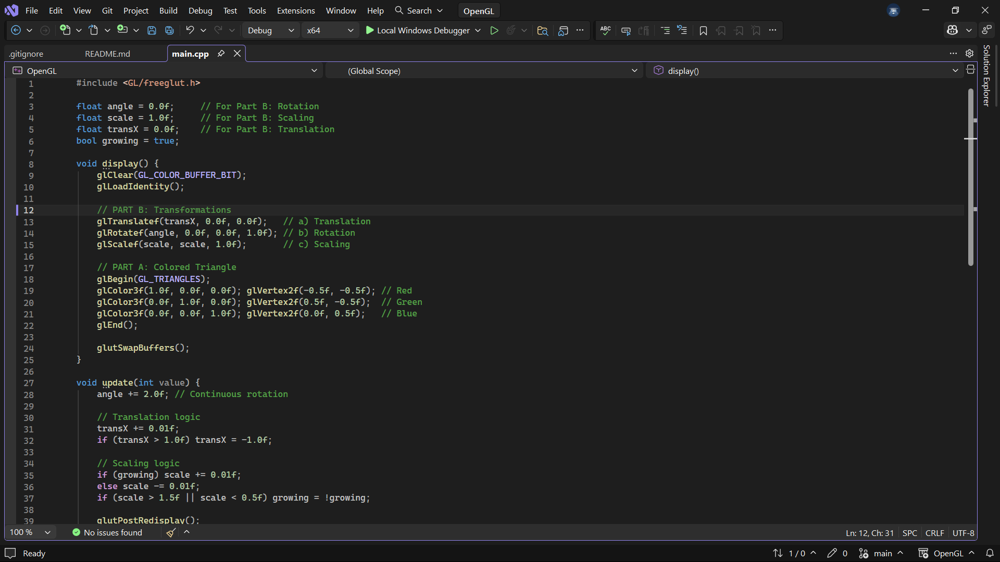
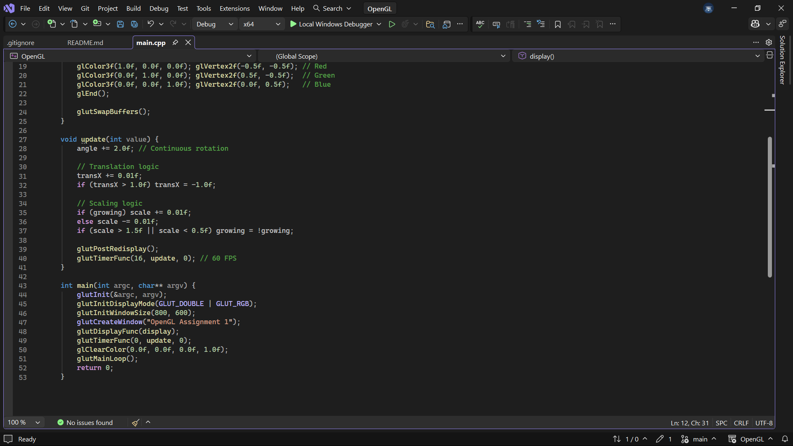

# OpenGL Assignment 1: Installation, Transformation, and Object Simulation

This repository contains the complete implementation for Assignment 1, covering the environment setup in Visual Studio 2026 and the application of 2D geometric transformations.

## Setup and Installation Steps (Part A)

Detailed documentation of the environment configuration can be found in the root file: **[setup_steps.pdf](./setup_steps.pdf)**.

To meet the requirement for a "Short explanation of setup steps", the following configuration was performed:

1. **Library Selection**: 
   - Utilized **FreeGLUT** as a modern, maintained alternative to the original GLUT library to handle window management and input callbacks.
   - **Crucial Fix**: Switched from MinGW static libraries (`.a` files) to **MSVC binaries** (`.lib`) to ensure compatibility with the Visual Studio 2026 linker.
   - Binaries sourced from [Martin Payne's FreeGLUT Windows Binaries](https://www.transmissionzero.co.uk/software/freeglut-devel/).

2. **Portable Project Structure**: 
   - To ensure the project is clonable and "ready-to-run," a local dependency structure was implemented within the repository:
     - `/include/GL`: Contains header files (`freeglut.h`, `glut.h`).
     - `/lib`: Contains the 64-bit static library (`freeglut.lib`).
     - `/bin`: Contains the runtime dynamic link library (`freeglut.dll`).

3. **IDE Configuration (Visual Studio 2026)**:
   - **Additional Include Directories**: Configured to `$(ProjectDir)include` using macros to ensure portability across different user environments.
   - **Additional Library Directories**: Configured to `$(ProjectDir)lib`.
   - **Linker Input**: Explicitly linked `freeglut.lib`, `opengl32.lib`, and `glu32.lib`.
   - **Runtime Deployment**: Placed `freeglut.dll` in the root directory alongside `main.cpp` so the executable can locate the entry points during execution.

## Transformation Logic (Part B)

The program renders a 2D colored triangle and applies the following dynamic transformations as required by the assignment guidelines:

* **Translation**: The object moves across the X-axis using `glTranslatef()`.
* **Rotation**: Continuous 360-degree rotation is achieved by incrementing an angle variable within a `glutTimerFunc` loop and applying `glRotatef()`.
* **Scaling**: A "pulsing" effect is created by dynamically modifying the scale factor with `glScalef()`, increasing and decreasing the size between set boundaries.

## Screenshots & Media

### Source Code Implementation (`main.cpp`)
| Part A: Environment & Setup | Part B: Transformation Logic |
| :--- | :--- |
|  |  |
| *Top section: Includes & Initialization* | *Bottom section: Transformation & Timer Logic* |

### Working Output
**[Click here to view the Output Recording (MP4)](./screenshots/output_recording.mp4)**

*(Note: If viewing on GitHub, you may need to download the MP4 file to play the video of the transformations in action.)*

---
**Author**: Rose Maina  
**Unit**: Computer Graphics  
**Tools**: Visual Studio 2026, FreeGLUT 3.4.0+